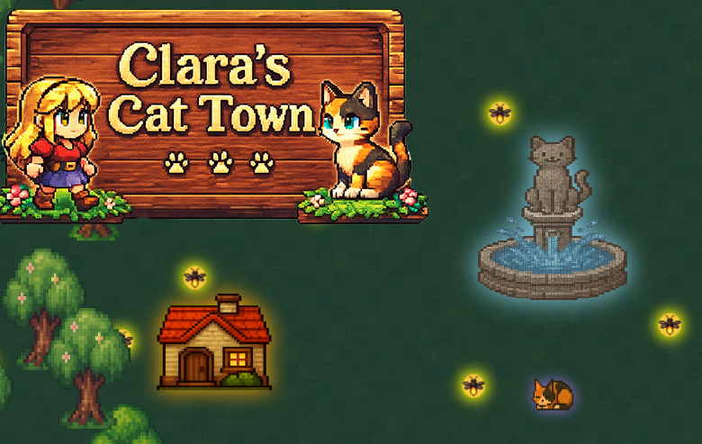

# Clara's Cat Town
## Version 0.2.8

A browser-based action RPG where you explore a charming town with your customizable cat companion.



## Features

- **Exploration**: Walk around a circular village centered on a magical cat fountain
- **Transformation**: Transform between human and cat forms with animated walking
- **Day/Night Cycle**: Dynamic lighting with beautiful transitions and time-based gameplay
- **Firefly Collection**: Catch magical fireflies at night to unlock special chests
- **Companion System**: Rescue animal friends from chests - larger chests contain bigger companions
- **Speed Boosts**: Collect hearts for temporary speed with visual HUD effects
- **Interior Design**: Decorate your house with customizable furniture
- **Quick Travel**: Teleport to the fountain via compass click or HOME key
- **Leveling System**: Gain XP and level up by collecting items and freeing companions
- **Background Music**: Relaxing soundtrack with in-game playlist controls

## How to Play

## Live Demo

[https://zeveck.github.io/cattown](https://zeveck.github.io/cattown)

### Getting Started
1. Clone/download the repo and open `index.html` in a web browser

### Controls
- **Arrow Keys** - Move your character
- **T** - Transform between human and cat
- **SPACE** - Magic attack
- **E** - Interact with objects (opens chests, enters/exits houses)
- **F** - Place/drop companion
- **HOME** - Teleport to fountain (with companions)
- **/ or ?** - Open help menu
- **ESC** - Close help menu

### Gameplay
- **Explore the Village**: Walk around the circular town centered on the magical cat fountain
- **Day/Night Cycle**: Watch as the world transitions between beautiful day and mysterious night
- **Collect Fireflies**: Catch magical fireflies at night by hitting them with magic attacks
  - Store fireflies in your jar (shown in HUD)
  - Use fireflies to unlock large treasure chests
- **Rescue Companions**: Open chests to free animal friends
  - Basic chests (purple) are free to open
  - Large chests require fireflies but contain bigger companions
  - Companions follow you and teleport with you
- **Speed Boosts**: Collect hearts for temporary speed boosts
  - HUD pulses with the heart's color when boosted
  - Three types: apple (deep pink), orange (hot pink), default (light pink)
- **Interior Design**: Decorate your house with furniture from the shop
  - Click and drag to place or move furniture
  - Customize colors and sizes
- **Quick Travel**: Click the compass or press HOME to teleport to the fountain

## File Structure

```
cattown/
├── index.html          # Main HTML file
├── game.js            # Game logic and mechanics
├── styles.css         # Styling
├── graphics/          # Game sprites and assets
│   ├── cat.png
│   ├── girl.png
│   ├── houses/        # House building graphics
│   ├── house-items/   # Furniture and interior items
│   ├── chests/        # Treasure chest graphics (multiple colors)
│   ├── fireflies/     # Firefly animation frames
│   └── ...
└── music/             # Background music tracks (SunoAI generated)
```

## Recent Updates

### v0.2.8
- **House Interior Enhancements**: Added textured floorboard graphic to house interior
  - Floorboards tile at 128x128 pixels for seamless repeating pattern
  - Only appears in room interior, excludes furniture shop UI area
  - Replaces solid color floor with realistic wood texture
- **Visual Polish**: Removed shadow ellipse from cat sprites
  - Cat sprites have built-in shadows or don't need separate shadows
  - Girl/human form retains shadow for depth
  - Fixes misplaced shadow during cat sleep animation

### v0.2.7
- **Bug Fixes**:
  - Fixed cat sleep animation not triggering - removed idleTime reset that prevented reaching 20s threshold
  - Cat now properly falls asleep after 20 seconds of being idle
- **Music Controls**: Click anywhere on canvas to start background music (in addition to moving)
- **Graphics**: Switched from grass_tile.png to grass_tile.jpg for better performance
- **Chest Sizing**: Increased chest size progression to 25% per tier for more dramatic scaling
  - Tier 1: 1.25x, Tier 2: 1.5x, Tier 3: 1.75x, Tier 4: 2.0x, Tier 5: 2.25x

### v0.2.6
- **Cat Sleeping Animation**: Cat now falls asleep after being idle for 20 seconds
  - Sleep state persists until player moves the cat
  - New sleeping sprite graphic
  - Yawn/lick animations only trigger before sleep (between 6-20 seconds idle)
- **Title Graphic**: Replaced rainbow gradient text title with custom title graphic
  - Fades out over 4 seconds at game start
  - Positioned above cat fountain
- **Help Menu Delay**: Increased auto-show delay from 5 to 10 seconds
  - Gives players more time to explore before the help menu appears

### v0.2.5
- **Compass Visual Enhancement**: Compass now always glows for better visibility
  - Golden glow visible during both day and night
  - Increased glow intensity (shadowBlur: 15) for compass needle border
  - Consistent golden color across both compass states (thumbnail and needle)

### v0.2.4
- **Idle Animation Tuning**: Refined cat idle animations for more natural behavior
  - Increased idle time threshold from 3s to 6s before animations can trigger
  - Reduced trigger frequency (1% chance vs 2% per frame)
  - Shortened animation duration from 2s to 1.2s for snappier feel
  - Added proper cooldown - idle timer resets after each animation to enforce 6s+ gap between animations
  - Animations now feel occasional and charming rather than repetitive

### v0.2.3
- **Cat Idle Animations**: Cat now performs charming idle animations when sitting still
  - Randomly yawns or licks paw after being idle for a few seconds
  - Animations play for 1.2 seconds before returning to normal idle pose
  - Adds personality and life to the cat companion

### v0.2.2
- **Cat Fountain Feature**: Central fountain now serves as the village landmark
  - Houses arranged in a circle around the fountain
  - Compass points to fountain when off-screen, shows fountain image when visible
  - Click compass or press HOME to teleport to fountain (companions teleport with you)
  - Compass glows at night with tooltip on hover
- **Firefly Collection System**: Magical fireflies appear throughout the map at night
  - Magic attacks target and change firefly colors
  - Collect fireflies by hitting them with magic
  - Fireflies stored in jar (displayed in HUD)
  - Use fireflies to unlock large treasure chests
  - Fireflies vanish during daytime
- **Enhanced Chest System**: Two-tier chest system with visual variety
  - Basic chests (purple, free to open) contain normal companions
  - Large chests (green/aqua/blue/red) require fireflies
  - Larger chests spawn bigger companions (scaled to chest size)
  - Probabilistic sizing - chests get larger farther from town
  - Colored chest graphics organized in folders
- **Speed Boost System**: Collect hearts for temporary movement speed
  - Three heart types with different colors and healing amounts
  - HUD pulses with heart color when speed boost is active
  - Visible day and night with multiple glow layers
  - Hearts glow faintly at night
- **Companion Improvements**:
  - Companions scale with chest size
  - Teleport with player to fountain
  - All chests now spawn 1 companion (large chests = large companions)
- **UI/UX Enhancements**:
  - Interactive help menu (press ?, /, or click ? button)
  - ESC key to close menus
  - Auto-show help menu after 5 seconds of inactivity (first time only)
  - In-game audio controls (mute, volume, prev/next track)
  - Improved chest interaction messages with HUD-style frames
  - Day/night indicator with countdown pie chart
  - XP and leveling system with visual progress bar
- **Cat Walking Animation**: Improved cat movement with alternating walking sprites
  - Sprites flip horizontally when moving right
  - Returns to idle sprite when stopped
- **Performance Optimizations**:
  - Offscreen canvas caching for firefly hue rotation
  - Removed expensive filter operations during gameplay
- **Bug Fixes**:
  - Fixed dropped companion rendering error
  - Fixed treasure chest overlap with houses and trees
  - Chests now maintain proper spacing from all objects
  - Fixed day/night timing to start at sunrise
  - Fixed E key interaction handling inside/outside houses
  - Corrected tree rendering order (now above buildings and chests)

### v0.1.1
- Fixed furniture placement bug where clicking to place new furniture would accidentally select already-placed furniture
- Improved interior furniture shop interaction
- Made nights darker for better atmosphere

## Technical Details

- Pure JavaScript (no frameworks)
- HTML5 Canvas for rendering
- Local storage for save data (planned)

## Development

Simply edit the files and refresh your browser to see changes. No build process required.

---

Design by Clara and family.
Coding done by Claude Code.
Graphics generated using ChatGPT.
Background music generated using SunoAI.
